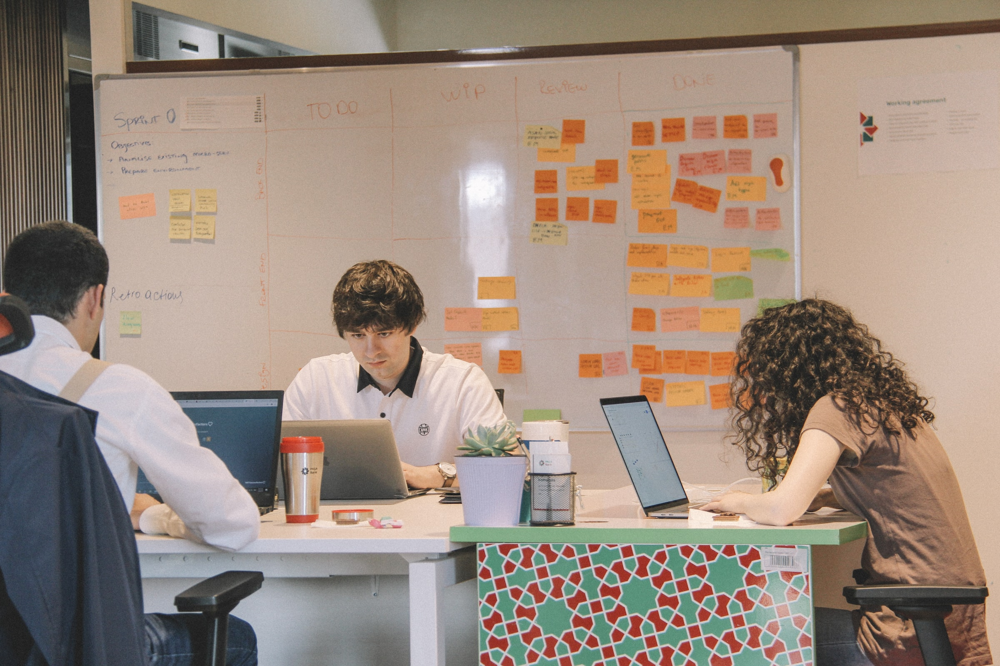

## First, some background

Since my last blog post, a lot has changed for me, both personally and professionally. I have switched jobs - twice - and am now a Senior Software Engineer at Dashlane. Moving from a role in which I was managing other managers to one in which I am an independent contributor (IC) again within a year has been quite a shift. My recent roles have looked like this:

- In-N-Out: Programming Manager
  - Note that I was reporting to the head of IT
  - Those reporting to me were also "Programming Supervisors" - aka Engineering Managers
  - Responsible for all of software development (mostly internal) - ERP, POS, HR Systems, etc.
  - Total team was ~20
- Updater: Engineering Manager
  - Managing ~6 frontend engineers
  - Spending ~20% of my time reviewing PRs, writing code, etc.
- Dashlane: Senior Software Engineer
  - Focus on React/TypeScript

I was initially promoted into management at In-N-Out in early 2016. Previous to that, I had been a full stack web developer, building a variety of internal applications. I was initially responsible for a smaller group, and was able to be involved in code reviews, bug fixes, and other smaller tasks.

However, as things progressed and I became involved in more and more teams and projects, I had to focus on the tasks that would be most effective given my role. In other words, I focused more on developing my team, overseeing projects, unblocking my engineers, and maintaining good relationships with other groups.

## What I liked about management

Despite my wanting to switch back to an engineering role, there was a lot I enjoyed about management. Those enjoyment factors fall into two main categories:

1. Coaching and developing the team
1. Improving team tools and processes

Each of these could be their own blog posts, but I will go into a little bit of specifics.

### Coaching and developing the team

I have a strong belief that this should be the primary responsibility and focus for most managers. This is where managers can _really_ become a force multiplier, by helping to improve every individual within their team. This growth can be in all sorts of areas - communication, technical, organizational, relationships, etc.

Being a manager, especially an effective one, is an entirely different job than being an engineer. It requires a different skillset, focus, and results to evaluate how well you are doing. I have been very happy to see that most businesses now have a separate IC and manager track, and manager isn't automatically viewed as the next step in an engineer's career.

So, once in a management role, you should be focused on helping your team improve. This takes many forms, such as being an umbrella and helping the team stay focused and protected. However, most important is helping to guide the team along their career path by providing coaching and feedback (the difference between those two could also be its own blog post...).

**This doesn't mean that you need to know everything**. That is a common misconception with newer managers. A lot of coaching is identifying the right questions to ask, and encouraging people along the path that they're already on. As you continue to grow in your management journey, it won't even be _possible_ to know everything - you will eventually get to a point where:

- You are managing people doing jobs that you haven't done yourself - different kinds of technology, different parts of the stack, etc.
- You're a full-time people manager and don't have enough time to keep up with the changing technology
- You're managing someone doing a job you did, but they have more seniority or experience doing it, and have better hard skills than you anyways

Coaching and feedback are tough skills to learn, and ultimately it comes down to practice and "getting the reps in." The resource that got me a kickstart in these areas was the [Manager Tools Podcast](https://www.manager-tools.com/manager-tools-basics) which has a "Basics" series that goes over these topics and more.

### Improving team tools and processes

The other area I enjoyed the most was in improving team tools and processes. It is important to note that this doesn't mean that, as a manager, you have to have all of the ideas on how to improve things. There will certainly be times where your perspective will allow you to see the bigger picture and imagine important changes that it might be hard for the team to. Very often, your team members will have a better understanding of their day-to-day challenges and what to do about them than you will. However, because of your perspective, it is often the case that you can elicit those improvements out of your team by asking the right questions. When you're heads down on a problem, it is sometimes hard to tell that something should change.

In the past, doing this has looked something like: asking how to fix an underlying problem during a retro, open-ended discusions during 1:1s with questions like "if you could change anything here, what would it be?", and identifying that a unified source control tool was needed (from legacy projects before Git was the standard). Some managers are able to do this by knowing about industry trends and tools that can help; others do it by being inquisitive and insightful. That's part of the fun! If you know your strengths, you can accomplish the same goals in so many different ways.

## Then why switch?

In reading this post, it might sound like I thoroughly enjoyed being a manager - and it's true, there were plenty of parts of it that I liked. So, jump back to being an IC? In short, it's because I felt like I had unfinished business on the technical side of things. I thoroughly enjoyed being an engineer and writing software. At first, I wasn't sure it would be possible - not contributing consistently over the course of 6 years feels like a tough barrier to overcome. However, in my last role as an EM, I was able to be technical enough to gain some confidence there and understood that it should be possible - albeit with a transition period.

On another note, as an engineer, your output is so much more tangible than a manager's. At the end of the day, you can look at a bug fix or new feature and know that you delivered that. The same cannot be said for managers. A lot of the job is creating alignment, communication, giving feedback to your team, and so on - and at the end of many of my days I felt like I had accomplished nothing, even if I had. Even when I knew that, logically, I was doing a good job, sometimes it didn't feel that way.

Work-life balance is another area that I felt would improve with this change. In my experience, this is overall more dependent on company than specific role. That said, in most workplaces, the role of a manager is going to involve far more meetings and pre-determined commitments. I wanted the calendar flexibility of an IC. As someone with a young child, it's been very helpful to be able to step away for a few minutes without worry to help out my partner and such.

A final important note here is that this is an amazing industry with solid salaries. I understand that in a lot of other roles, switching back to being an IC would involve a big pay cut. Fortunately, software engineers are well compensated, which means that's not a blocker. While it's a different career path with some compensation changes in most companies, I decided that it was more important to feel happy and excited about my career.

## How being an IC is going

I'm very happy I made the change! It has been a lot of fun so far to be back to writing and reviewing code daily. On top of that, my current company, Dashlane, has some very interesting constraints and technologies that are keeping me constantly challenged and learning. There has certainly been a transition period - different skills and habits are needed in each role - but I'm starting to feel like I'm mostly through that and am able to be a useful teammate and healthy contributor.

For example, as a manager, I was "rewarded" to switch between tasks often and respond to others quickly. There was very little deep work in comparison to being an engineer. As such, I've been having to re-train my brain some to be in less of a rush, and focus on doing things correctly rather than quickly. That is exactly the sort of thing I was hoping to encounter in this role change, but it has still required effort; I recently read [Deep Work by Cal Newport](https://www.amazon.com/Deep-Work-Focused-Success-Distracted/dp/1455586692) and adopted many of the practices from that book, and I'm also trying to build up a habit of daily meditation.

I have also noticed an increased need for high quality written communication, which is part of why I'm working to reboot this blog. While there was also writing as a manager, I'm also working with teammates in other timezones much more, and there's an increased focus on async communication - as well as just writing more PRs/RFCs/etc. Again, this is a welcome change, but also takes some adjustment. I will likely need to do some further training here in the future.

## What's next?

For the time being, I'm very happy with my new company and role, and have no desire to change things up. But I don't want to commit to a permanent change. As I said previously, I did enjoy being a manager, and do see it as a possibility in the future again. I know that this is a decision others go through as well and flip-flop on; Charity Majors has an [excellent blog post](https://charity.wtf/2017/05/11/the-engineer-manager-pendulum/) on the topic. Knowing that I'm not the only one makes me feel much better about the change and what the future might hold.

As for this blog, I will be attempting to write much more consistently (an 18 month gap is obviously not ideal!). There are lot of potential topics permeating in my brain - I've been learning a ton and using a bunch of different tools lately, so there is a lot to explore!
